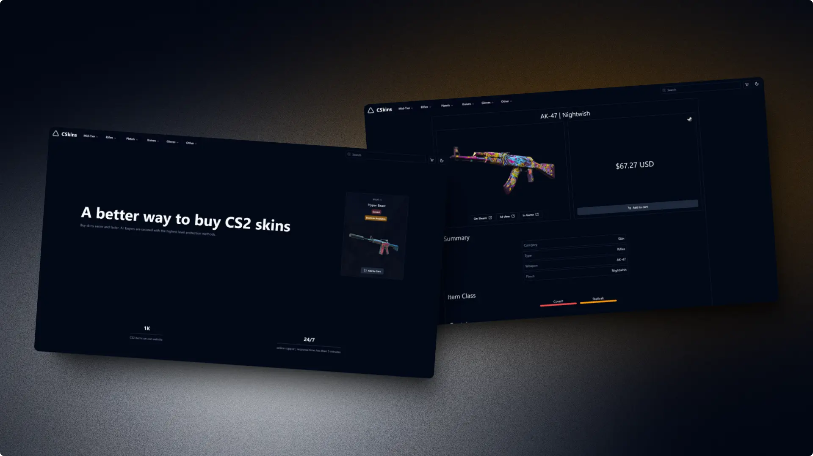
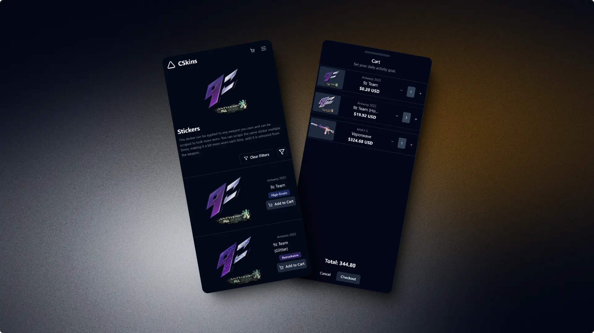

<h1 align="center">Shopping Cart</h1>

# Description

This project is an interactive shopping cart for CS:GO skins, developed as part of The Odin Project course. It utilizes the CS:GO API to fetch up-to-date information about available skins and allows users to explore and "purchase" their favorite skins.

# Features

- Display of CS:GO skins fetched from the [CSGO API](https://bymykel.github.io/CSGO-API/)
- Shopping cart functionality
- Responsive and attractive user interface
- Skin filtering and search capabilities

# Technologies Used

- React
- React Router DOM
- TypeScript

# Acknowledgments

- The Odin Project for providing the structure and challenge for this project.
- CSGO API for providing skin data.

